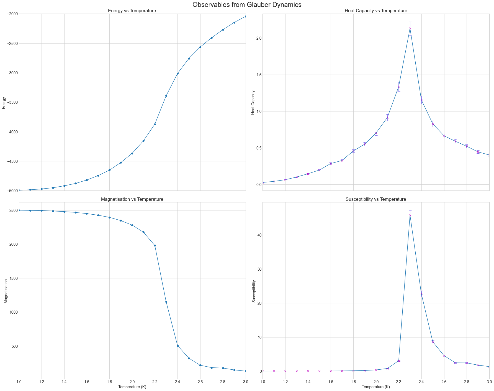
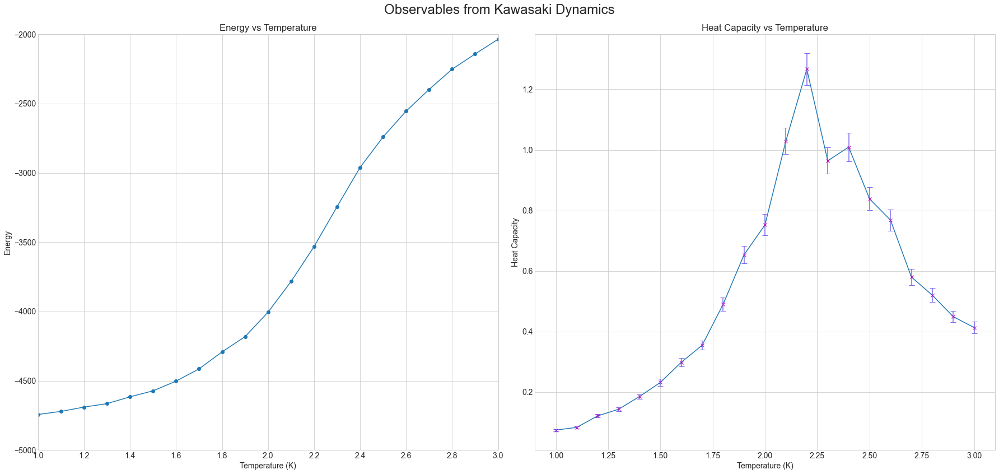

# Ising Model - Coursework 1 (2021 - 2022)

<b>Course Name:</b> Modelling and Visualisation in Physics
<br><b>Coursework Name:</b> Ising Model
<br><b>Objective:</b> Model the state of the ising model for a 2D square lattice of length l with l<sup>2</sup> spins.
Program a drone so that it can read information from several sensors and come back to the starting location.
<br><b>Programming Language:</b> Python3
<br><b>Final Mark:</b> 14/15 - made a small mistake computing the susceptibility. It is defined as ...
but I used |M| instead so the results are a bit different.

## Files
<ul>
  <li> <a href="IsingModelDocument.pdf">IsingModelDocument.pdf</a> --> This pdf file contains the description followed to complete the project.
  <li> <a href="./src">src</a> --> This directory contains the whole project.
  <li> <a href="test/test_plots.ipynb">test_plots.ipynb</a> --> Jupyter Notebook to show the plots of the observables computed in the simulations (and stored in <em>output_files</em>).
</ul>

## Brief description of the ising model
The purpose of this project is to learn how to use Monte Carlo Markov Chain methods. I am implementing the <em>metropolis algorithm</em> in conjunction with Glauber Dynamics or Kawasaki Dynamics to model the evolution of the ising model at a given temperature T.

The Ising Model in the project consists of a square lattice whose elements correspond to atomic spins. They can be in one of two states (+1 or -1), representing their magnetic dipole moment; and they can only interact with their neighbours.

When the neighbouring spins have the same spin (or "direction") the energy of the whole system is lower. As a consequence, the system will tend to the configuration in which all spins have the same value. Nonetheless, heat disturbs the model and when the temperature increases we can see how different structural phases appear. As I show with my results, we can identify a critical temperature that is related to the phase transition suffered by the system.

## Getting Started

These subsections will help you get a copy of the project and understand how to run it on your local machine for development and testing purposes.
I will discuss how to clone this repository and set it up in any IDE of your choice. Furthermore, instructions on how to run the server will be given as well as how to run the project from the terminal.

### How to Install

The first thing you should do is clone this repository into your local machine. You can do this with the following command:
```
git clone https://github.com/Paramiru/Ising-Model
```
Once you have cloned the repository, you should check your current version of Java. I used Python3 for the project. You can check the version you are currently using running this command in the terminal.
```
python --version
```
In order to run the project with the same version I am using you can use the environment.yml file to import my conda environment using:
```
conda env create -f environment.yml
```
This will create an environment named <em>IsingModel</em> which you can use for running the code without having to install the dependencies on your system. Read <a href="https://realpython.com/python-virtual-environments-a-primer/">this article</a> to understand the reasons for why virtual environments are important in Python.

## Running the Project 

Once you have cloned the repository and have the conda environment (or another virtual environment with the required dependencies) you can then run the **ising_model.py** file which will plot the animation of the ising model.

The code will ask for three different things:
<ol>
    <li>Length of the lattice: This should be a number greater than 1. For a fast simulation a number between 10 and 20 is ideal. However, to see the behaviour in a large scale you can try with 50 so there are 2500 spins overall.
    <li>Dynamics to use: Enter 'g' for Glauber dynamics or 'k' for using Kawasaki.
    <li>Temperature of the system: This will be the temperature used in the metropolis algorithm to calculate the probability of a spin randomly changing its state. To see the low temperature behaviour use T between 1.0 and 2.0. Using bigger numbers will show configurations in which the spins are not in the same direction and will be about to suffer from a phase transition.
</ol>

If you want to get the data from the simulations, you should modify the code in `main()` substituting `    isingModel.plot_equilibrium_state()` with `isingModel.get_magnetisation_and_energy_data(ts, dynamics)` where 
* `ts` corresponds to a numpy array with the temperatures in which the simulation will be run. I used `ts = np.arange(1.0, 3.1, step=0.1)` for my simulations.
* `dynamics` has glauber as a default. If you want to use kawasaki dynamics set the argument of the method call to `change_spin_kawasaki`.
## Built With

* [Python3](https://www.python.org/downloads/)
* [Conda](https://docs.conda.io/en/latest/) - Dependency Management

## Maven Dependencies

* [Numpy](https://numpy.org/doc/stable/index.html)
* [Matplotlib](https://matplotlib.org/stable/)

## Results obtained from the Ising Model
To reproduce these results you can go to <a href="">test/test_plots.ipynb</a> and run the cells in the jupyter notebook.

All these measurements were taken for a 50 x 50 square lattice.

Note: If you run your own simulation with different temperatures and/or length of the lattice you should modify the notebook to load the data you obtained.
### Using Glauber Dynamics
<br>
<p align="center">
  
  <br>
</p>

<hr>

### Using Kawasaki Dynamics
For Kawasaki Dynamics I am not showing the magnetisation or the susceptibility. Kawasaki does not have to change the number of up (or down) spins in the lattice. Consequently, the magnetisation is always 0 (I start the simulation with the ground state where half the particles are spin up and the other half are spin down). The susceptibility will be 0 as well.

<p align="center">
  
  <br>
</p>

<hr>

## Authors

* **Pablo Miró** - [Paramiru](https://github.com/Paramiru)

